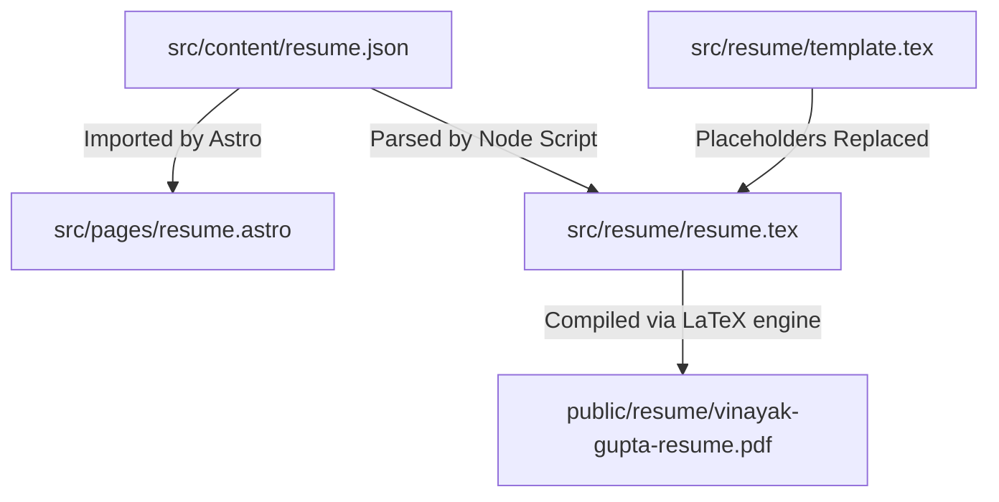

# Resume Generation & PDF Build Flow

This directory manages the resume template, dynamic LaTeX generation, and the compilation pipeline.

## Architecture

We use a single-source-of-truth JSON format that automatically updates both the web-native portfolio page and the downloadable PDF.



1. **JSON Source of Truth**: [resume.json](file:///E:/Vinayak's%20Lab/ctrl-infinity.github.io/.worktrees/resume-section/src/content/resume.json) contains all resume fields (basics, experience, skills, projects, and education).
2. **LaTeX Template**: [template.tex](file:///E:/Vinayak's%20Lab/ctrl-infinity.github.io/.worktrees/resume-section/src/resume/template.tex) defines the custom layout, font packages, margins, and LaTeX macros for formatting the document.
3. **Build Script**: [build-tex.js](file:///E:/Vinayak's%20Lab/ctrl-infinity.github.io/.worktrees/resume-section/scripts/build-tex.js) escapes special LaTeX characters, formats bold items (`**bold**` $\rightarrow$ `\textbf{bold}`), and generates [resume.tex](file:///E:/Vinayak's%20Lab/ctrl-infinity.github.io/.worktrees/resume-section/src/resume/resume.tex).
4. **Local Dev & CI Build**: compiles the generated `resume.tex` into the static binary PDF served at [public/resume/vinayak-gupta-resume.pdf](file:///E:/Vinayak's%20Lab/ctrl-infinity.github.io/.worktrees/resume-section/public/resume/vinayak-gupta-resume.pdf).

---

## Commands

### 1. Generate `resume.tex` from JSON
Any time you update [resume.json](file:///E:/Vinayak's%20Lab/ctrl-infinity.github.io/.worktrees/resume-section/src/content/resume.json), run this script to regenerate the LaTeX source file:
```bash
node scripts/build-tex.js
```

### 2. Compile LaTeX to PDF

#### Method A: Online API Compiler (Recommended for Local Dev)
If you don't have a LaTeX distribution (like MacTeX or TeXLive) installed locally, use the helper script to compile via a free public API:
```bash
node scripts/compile-tex-api.js
```
This sends a request to the LaTeX-on-HTTP endpoint and automatically saves the resulting PDF into `public/resume/vinayak-gupta-resume.pdf`.

#### Method B: Local LaTeX Compiler
If you have `pdflatex` installed in your terminal, compile using the following command sequence:
```bash
# Compile to PDF (creates src/resume/resume.pdf)
pdflatex -output-directory=src/resume/ src/resume/resume.tex

# Create public destination folder if it doesn't exist
mkdir -p public/resume/

# Move and rename to destination
mv src/resume/resume.pdf public/resume/vinayak-gupta-resume.pdf
```

---

## CI/CD Automation (GitHub Actions)

When you push changes to `main`, the GitHub Actions workflow [.github/workflows/deploy.yml](file:///E:/Vinayak's%20Lab/ctrl-infinity.github.io/.worktrees/resume-section/.github/workflows/deploy.yml) handles the compilation automatically:

1. Installs Node and project dependencies.
2. Runs `node scripts/build-tex.js` to create `src/resume/resume.tex`.
3. Runs `xu-cheng/latex-action@v3` to compile the LaTeX file inside a container containing the TeX environment.
4. Moves the resulting PDF into `public/resume/vinayak-gupta-resume.pdf` right before running `astro build`.

This guarantees that the PDF is always compiled fresh from your JSON updates on every deployment without requiring binaries to be checked into your git history.
